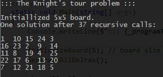
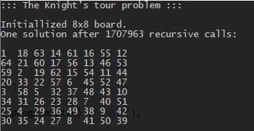

# CA.BackTracking.KnightTour
Solver for [Kinght's Tour problem](https://en.wikipedia.org/wiki/Knight%27s_tour) using brute force with backtracking.

This is a combinatorial problem with worst-case complexity O(k^N) where N is the total number of cells in the board and k is a small constant.

NOTE: A brute-force search using backtracking algorithm for a knight's tour is impractical on all but the smallest boards.
For example, there are approximately 4×10^51 (i.e., 19,591,828,170,979,904 tours) possible move sequences on an 8 × 8 board,
and it is well beyond the capacity of modern computers (or networks of computers) to perform operations on such a large set.
This implementation is just to practice backtracking, which is quite important.

## Output examples

This is always quick.

This was quick, but in general you will need to wait long...

